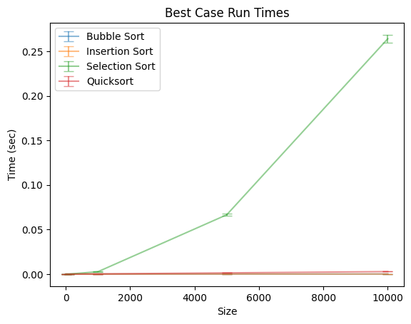
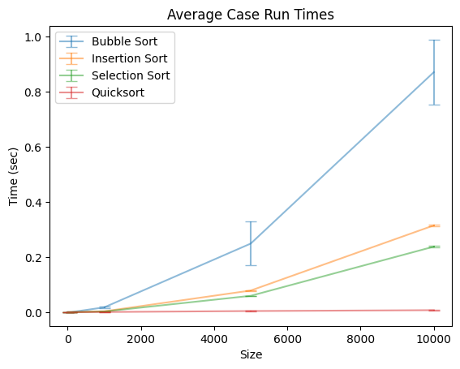
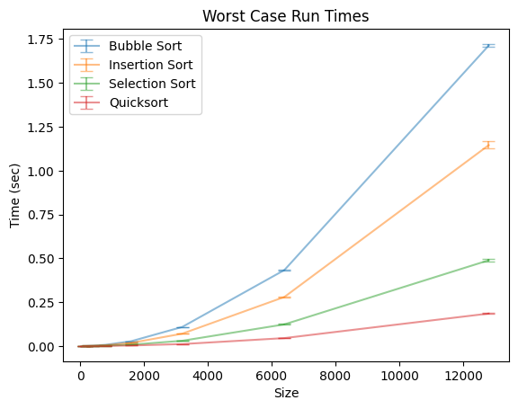

# CSCI 311: Data Structures and Algorithms – Labs & Projects

## Lab 1: Intro / Refreshers
Functions implemented:
1. Collatz length
2. Print min, mean, max
3. Sum all elements in a vector
4. Remove values greater than a passed integer
5. Check whether list B is a sublist of list A
6. Primality test
7. Sum of all primes less than N
8. More efficient primality test
9. More efficient sum of primes
10. Sieve of Eratosthenes

## Lab 2: Recursion
Functions implemented:
1. Number of points needed to construct a triangle with *n* dots
2. *n*th Fibonacci number
3. Sum all elements in a vector
4. Find max value in a list
5. Check if a list is sorted
6. Check if a string is a palindrome
7. Binary search
8. Subset sum (check whether any subset sums to a passed integer)

## Lab 3: Binary Search Tree (BST)
Functions implemented:
1. `isBST` – Check if tree is BST
2. `search` – find node containing passed integer
3. `insert` – insert passed value into tree
4. `preOrder` – preorder traversal, push values into vector as function iterates

## Lab 4: BST Continued
Includes Lab 3 plus:
1. `minimum` – find minimum value in tree
2. `maximum` – find maximum value in tree
3. `delete` – delete a passed value in tree if exists
4. `inOrder` – inorder traversal, push values into vector as function iterates
5. `postOrder` – postorder traversal, push values into vector as function iterates

## Project 1: Sorting Benchmark
Algorithms:
- Bubble sort
- Insertion sort
- Selection sort
- Quick sort

Benchmark setup:
- 50 vectors per size
- Sizes: 100, 200, 400, 800, 1600, 3200, 6400, 12800

### Graphs
**Best case** 

**Average case** 

**Worst case** 

